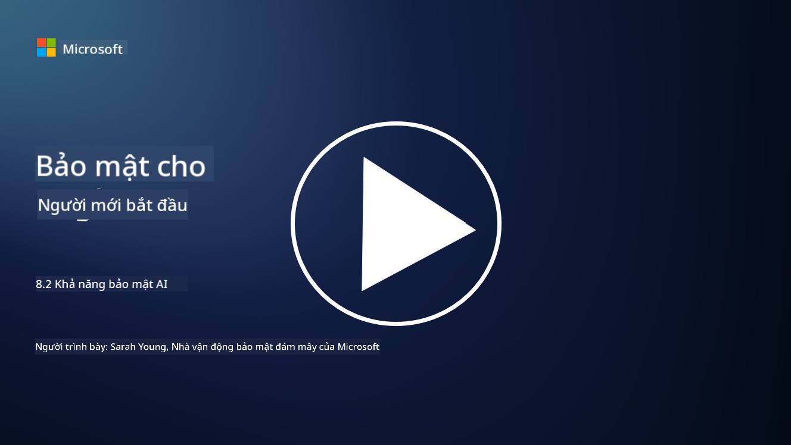

<!--
CO_OP_TRANSLATOR_METADATA:
{
  "original_hash": "b6bb7175672298d1e2f73ba7e0006f95",
  "translation_date": "2025-09-04T01:06:05+00:00",
  "source_file": "8.2 AI security capabilities.md",
  "language_code": "vi"
}
-->
# Khả năng bảo mật AI

## Hiện tại chúng ta có những công cụ và khả năng nào để bảo mật hệ thống AI?

Hiện tại, có một số công cụ và khả năng để bảo mật hệ thống AI:

-   **Counterfit**: Một công cụ tự động mã nguồn mở để kiểm tra bảo mật hệ thống AI, được thiết kế nhằm giúp các tổ chức thực hiện đánh giá rủi ro bảo mật AI và đảm bảo độ bền vững của các thuật toán.
-   **Công cụ Học Máy Đối Kháng**: Các công cụ này đánh giá độ bền vững của mô hình học máy trước các cuộc tấn công đối kháng, giúp xác định và giảm thiểu các lỗ hổng.
-   **Bộ Công Cụ Bảo Mật AI**: Có các bộ công cụ mã nguồn mở cung cấp tài nguyên để bảo mật hệ thống AI, bao gồm thư viện và khung làm việc để triển khai các biện pháp bảo mật.
-   **Nền Tảng Hợp Tác**: Các mối quan hệ đối tác giữa các công ty và cộng đồng AI nhằm phát triển các công cụ quét bảo mật chuyên biệt cho AI và các công cụ khác để bảo vệ chuỗi cung ứng AI.

Những công cụ và khả năng này là một phần của lĩnh vực đang phát triển, tập trung vào việc tăng cường bảo mật cho hệ thống AI trước nhiều mối đe dọa. Chúng đại diện cho sự kết hợp giữa nghiên cứu, công cụ thực tiễn và sự hợp tác trong ngành nhằm giải quyết các thách thức độc đáo mà công nghệ AI đặt ra.

## Còn về AI red teaming thì sao? Nó khác gì so với red teaming bảo mật truyền thống?

AI red teaming khác với red teaming bảo mật truyền thống ở một số khía cạnh chính:

-   **Tập trung vào Hệ Thống AI**: AI red teaming đặc biệt nhắm đến các lỗ hổng độc đáo của hệ thống AI, như mô hình học máy và các quy trình dữ liệu, thay vì cơ sở hạ tầng IT truyền thống.
-   **Kiểm tra Hành Vi AI**: Nó bao gồm việc kiểm tra cách hệ thống AI phản ứng với các đầu vào bất thường hoặc không mong đợi, từ đó phát hiện các lỗ hổng có thể bị kẻ tấn công khai thác.
-   **Khám phá Lỗi của AI**: AI red teaming xem xét cả lỗi ác ý và lỗi vô tình, cân nhắc một tập hợp rộng hơn các nhân vật và khả năng lỗi hệ thống ngoài các vi phạm bảo mật.
-   **Tiêm Prompt và Tạo Nội Dung**: AI red teaming cũng bao gồm việc kiểm tra các lỗi như tiêm prompt, nơi kẻ tấn công thao túng hệ thống AI để tạo ra nội dung có hại hoặc không chính xác.
-   **AI Có Đạo Đức và Trách Nhiệm**: Đây là một phần của việc đảm bảo AI có trách nhiệm ngay từ thiết kế, đảm bảo hệ thống AI có khả năng chống lại các nỗ lực khiến chúng hoạt động không như mong muốn.

Nhìn chung, AI red teaming là một thực hành mở rộng, không chỉ bao gồm việc kiểm tra các lỗ hổng bảo mật mà còn kiểm tra các loại lỗi hệ thống khác đặc trưng cho công nghệ AI. Đây là một phần quan trọng trong việc phát triển các hệ thống AI an toàn hơn bằng cách hiểu và giảm thiểu các rủi ro mới liên quan đến triển khai AI.

## Đọc thêm

 - [Microsoft AI Red Team xây dựng tương lai AI an toàn hơn | Microsoft Security Blog](https://www.microsoft.com/en-us/security/blog/2023/08/07/microsoft-ai-red-team-building-future-of-safer-ai/?WT.mc_id=academic-96948-sayoung)
 - [Thông báo khung tự động mã nguồn mở của Microsoft để red team hệ thống AI tạo sinh | Microsoft Security Blog](https://www.microsoft.com/en-us/security/blog/2024/02/22/announcing-microsofts-open-automation-framework-to-red-team-generative-ai-systems/?WT.mc_id=academic-96948-sayoung)
 - [Công Cụ Bảo Mật AI: Bộ Công Cụ Mã Nguồn Mở | Wiz](https://www.wiz.io/academy/ai-security-tools)

---

**Tuyên bố miễn trừ trách nhiệm**:  
Tài liệu này đã được dịch bằng dịch vụ dịch thuật AI [Co-op Translator](https://github.com/Azure/co-op-translator). Mặc dù chúng tôi cố gắng đảm bảo độ chính xác, xin lưu ý rằng các bản dịch tự động có thể chứa lỗi hoặc không chính xác. Tài liệu gốc bằng ngôn ngữ bản địa nên được coi là nguồn tham khảo chính thức. Đối với các thông tin quan trọng, chúng tôi khuyến nghị sử dụng dịch vụ dịch thuật chuyên nghiệp từ con người. Chúng tôi không chịu trách nhiệm cho bất kỳ sự hiểu lầm hoặc diễn giải sai nào phát sinh từ việc sử dụng bản dịch này.