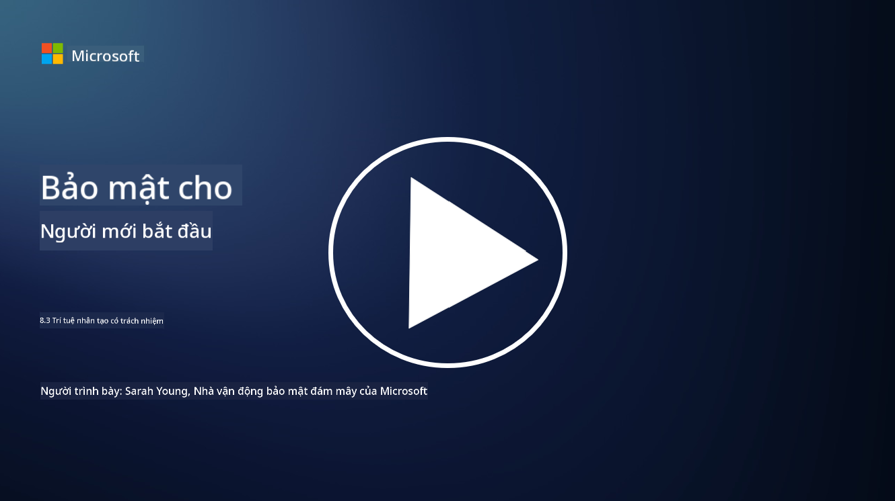

<!--
CO_OP_TRANSLATOR_METADATA:
{
  "original_hash": "5e9775ee91bde7d44577891d5f11c4c5",
  "translation_date": "2025-09-04T00:06:34+00:00",
  "source_file": "8.3 Responsible AI.md",
  "language_code": "vi"
}
-->
# Trí tuệ nhân tạo có trách nhiệm

## Trí tuệ nhân tạo có trách nhiệm là gì và nó liên quan như thế nào đến bảo mật AI?

Trí tuệ nhân tạo có trách nhiệm đề cập đến việc phát triển và sử dụng trí tuệ nhân tạo theo cách có đạo đức, minh bạch và phù hợp với các giá trị xã hội. Nó bao gồm các nguyên tắc như công bằng, trách nhiệm và tính bền vững, đảm bảo rằng các hệ thống AI được thiết kế và vận hành để mang lại lợi ích cho cá nhân, cộng đồng và toàn xã hội.

Mối quan hệ giữa trí tuệ nhân tạo có trách nhiệm và bảo mật AI rất quan trọng vì:

-   **Cân nhắc đạo đức**: Trí tuệ nhân tạo có trách nhiệm bao gồm các cân nhắc đạo đức ảnh hưởng trực tiếp đến bảo mật, chẳng hạn như quyền riêng tư và bảo vệ dữ liệu. Đảm bảo rằng các hệ thống AI tôn trọng quyền riêng tư của người dùng và bảo vệ dữ liệu cá nhân là một khía cạnh quan trọng của trí tuệ nhân tạo có trách nhiệm.
-   **Tính bền vững và độ tin cậy**: Các hệ thống AI phải bền vững trước các hành vi thao túng và tấn công, đây là nguyên tắc cốt lõi của cả trí tuệ nhân tạo có trách nhiệm và bảo mật AI. Điều này bao gồm việc bảo vệ trước các cuộc tấn công đối kháng và đảm bảo tính toàn vẹn của các quy trình ra quyết định của AI.
-   **Minh bạch và khả năng giải thích**: Một phần của trí tuệ nhân tạo có trách nhiệm là đảm bảo rằng các hệ thống AI minh bạch và các quyết định của chúng có thể được giải thích. Điều này rất quan trọng đối với bảo mật, vì các bên liên quan cần hiểu cách các hệ thống AI hoạt động để tin tưởng vào các biện pháp bảo mật của chúng.
-   **Trách nhiệm giải trình**: Các hệ thống AI cần chịu trách nhiệm cho các hành động của mình, điều này có nghĩa là phải có các cơ chế để truy vết các quyết định và khắc phục bất kỳ vấn đề nào. Điều này phù hợp với các thực hành bảo mật giám sát và kiểm tra các hoạt động của hệ thống để ngăn chặn và ứng phó với các vi phạm.

Tóm lại, trí tuệ nhân tạo có trách nhiệm và bảo mật AI có mối quan hệ chặt chẽ, với các thực hành trí tuệ nhân tạo có trách nhiệm tăng cường bảo mật cho các hệ thống AI và ngược lại. Việc áp dụng các nguyên tắc trí tuệ nhân tạo có trách nhiệm giúp tạo ra các hệ thống AI không chỉ có đạo đức mà còn an toàn hơn trước các mối đe dọa tiềm tàng.

## Làm thế nào để tôi đảm bảo hệ thống AI của mình vừa an toàn vừa có đạo đức?

Đảm bảo rằng hệ thống AI của bạn vừa an toàn vừa có đạo đức đòi hỏi một cách tiếp cận đa chiều bao gồm các bước sau:

- **Tuân thủ các nguyên tắc đạo đức**: Thực hiện theo các hướng dẫn đạo đức đã được thiết lập, nhấn mạnh đến phúc lợi của con người, xã hội và môi trường; công bằng; bảo vệ quyền riêng tư; độ tin cậy; minh bạch; khả năng tranh cãi; và trách nhiệm giải trình.

- **Thực hiện các biện pháp bảo mật mạnh mẽ**: Sử dụng các chương trình kiểm tra bảo mật chủ động và quản lý niềm tin, rủi ro, bảo mật AI để bảo vệ trước các mối đe dọa và lỗ hổng.

- **Tham gia các bên liên quan đa dạng**: Thu hút sự tham gia của nhiều bên trong quá trình phát triển AI, bao gồm các nhà đạo đức học, nhà khoa học xã hội và đại diện từ các cộng đồng bị ảnh hưởng để đảm bảo các quan điểm và giá trị đa dạng được xem xét.

- **Đảm bảo minh bạch và khả năng giải thích**: Đảm bảo rằng các quy trình ra quyết định của AI minh bạch và có thể giải thích, tạo điều kiện cho sự tin tưởng và dễ dàng xác định các thiên kiến hoặc lỗi tiềm ẩn.

- **Bảo vệ quyền riêng tư dữ liệu**: Bảo vệ quyền riêng tư và tính xác thực của dữ liệu thông qua mã hóa và các biện pháp bảo vệ dữ liệu khác để tôn trọng quyền riêng tư của người dùng.

- **Kích hoạt giám sát của con người**: Thực hiện các cơ chế giám sát của con người để cho phép tranh cãi các quyết định do hệ thống AI đưa ra và đảm bảo trách nhiệm giải trình.

- **Cập nhật thông tin về an toàn AI**: Luôn cập nhật các nghiên cứu và thảo luận mới nhất về an toàn AI để hiểu rõ bối cảnh đang thay đổi của bảo mật và đạo đức AI.

- **Tuân thủ các quy định**: Đảm bảo rằng hệ thống AI của bạn tuân thủ tất cả các luật và quy định liên quan, bao gồm các luật bảo vệ dữ liệu, luật chống phân biệt đối xử và các hướng dẫn cụ thể theo ngành.

## Bạn có thể cho tôi một số ví dụ về vấn đề bảo mật do việc sử dụng AI không đạo đức gây ra không?

Dưới đây là một số ví dụ về các vấn đề bảo mật có thể phát sinh từ việc sử dụng AI không đạo đức:

- **Quyết định thiên vị**: Các hệ thống AI có thể duy trì và khuếch đại các thiên kiến hiện có nếu chúng được huấn luyện trên các tập dữ liệu thiên vị. Ví dụ, nếu một công cụ tìm kiếm được huấn luyện trên dữ liệu phản ánh các định kiến xã hội, nó có thể hiển thị các kết quả tìm kiếm thiên vị, dẫn đến sự đối xử không công bằng hoặc phân biệt đối xử.

- **AI trong hệ thống tư pháp**: Việc sử dụng AI trong các quyết định pháp lý có thể gây ra các lo ngại đạo đức, đặc biệt nếu quy trình ra quyết định của AI thiếu minh bạch hoặc bị ảnh hưởng bởi dữ liệu thiên vị. Điều này có thể dẫn đến các kết quả pháp lý không công bằng và xâm phạm quyền của cá nhân.

- **Thao túng hệ thống AI**: Các hệ thống AI có thể dễ bị tấn công đối kháng, nơi các thay đổi nhỏ trong dữ liệu đầu vào có thể gây ra các kết quả sai lệch. Ví dụ, các phương tiện tự hành có thể bị đánh lừa để hiểu sai các biển báo giao thông, dẫn đến các rủi ro an toàn.

- **Giám sát bằng AI**: Việc triển khai AI cho mục đích giám sát có thể dẫn đến vi phạm quyền riêng tư, đặc biệt nếu được sử dụng mà không có sự đồng ý thích hợp hoặc theo cách xâm phạm tự do cá nhân. Điều này đặc biệt đáng lo ngại trong các chế độ độc tài có thể sử dụng AI để giám sát và đàn áp bất đồng chính kiến.

Những ví dụ này nhấn mạnh tầm quan trọng của các cân nhắc đạo đức trong việc phát triển và triển khai các hệ thống AI để ngăn chặn các vấn đề bảo mật và bảo vệ quyền lợi và quyền riêng tư của cá nhân.

## Đọc thêm

 - [Microsoft Responsible AI Standard v2 General Requirements](https://query.prod.cms.rt.microsoft.com/cms/api/am/binary/RE5cmFl?culture=en-us&country=us&WT.mc_id=academic-96948-sayoung)
 - [Responsible AI (mit.edu)](https://sloanreview.mit.edu/big-ideas/responsible-ai/)
 - [13 Principles for Using AI Responsibly (hbr.org)](https://hbr.org/2023/06/13-principles-for-using-ai-responsibly)

---

**Tuyên bố miễn trừ trách nhiệm**:  
Tài liệu này đã được dịch bằng dịch vụ dịch thuật AI [Co-op Translator](https://github.com/Azure/co-op-translator). Mặc dù chúng tôi cố gắng đảm bảo độ chính xác, xin lưu ý rằng các bản dịch tự động có thể chứa lỗi hoặc không chính xác. Tài liệu gốc bằng ngôn ngữ bản địa nên được coi là nguồn thông tin chính thức. Đối với các thông tin quan trọng, khuyến nghị sử dụng dịch vụ dịch thuật chuyên nghiệp bởi con người. Chúng tôi không chịu trách nhiệm cho bất kỳ sự hiểu lầm hoặc diễn giải sai nào phát sinh từ việc sử dụng bản dịch này.