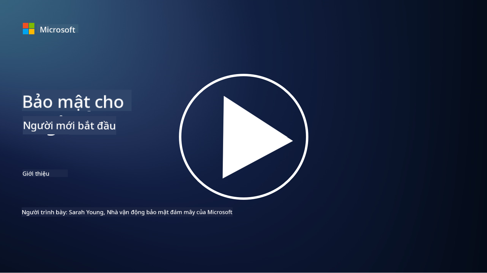

<!--
CO_OP_TRANSLATOR_METADATA:
{
  "original_hash": "ec0b921727399a8a980305086a6d3832",
  "translation_date": "2025-09-04T06:44:13+00:00",
  "source_file": "README.md",
  "language_code": "vi"
}
-->
  
  
  
  
  
  

### 🌐 Hỗ trợ đa ngôn ngữ  

#### Được hỗ trợ qua GitHub Action (Tự động & Luôn cập nhật)  

[French](../fr/README.md) | [Spanish](../es/README.md) | [German](../de/README.md) | [Russian](../ru/README.md) | [Arabic](../ar/README.md) | [Persian (Farsi)](../fa/README.md) | [Urdu](../ur/README.md) | [Chinese (Simplified)](../zh/README.md) | [Chinese (Traditional, Macau)](../mo/README.md) | [Chinese (Traditional, Hong Kong)](../hk/README.md) | [Chinese (Traditional, Taiwan)](../tw/README.md) | [Japanese](../ja/README.md) | [Korean](../ko/README.md) | [Hindi](../hi/README.md) | [Bengali](../bn/README.md) | [Marathi](../mr/README.md) | [Nepali](../ne/README.md) | [Punjabi (Gurmukhi)](../pa/README.md) | [Portuguese (Portugal)](../pt/README.md) | [Portuguese (Brazil)](../br/README.md) | [Italian](../it/README.md) | [Polish](../pl/README.md) | [Turkish](../tr/README.md) | [Greek](../el/README.md) | [Thai](../th/README.md) | [Swedish](../sv/README.md) | [Danish](../da/README.md) | [Norwegian](../no/README.md) | [Finnish](../fi/README.md) | [Dutch](../nl/README.md) | [Hebrew](../he/README.md) | [Vietnamese](./README.md) | [Indonesian](../id/README.md) | [Malay](../ms/README.md) | [Tagalog (Filipino)](../tl/README.md) | [Swahili](../sw/README.md) | [Hungarian](../hu/README.md) | [Czech](../cs/README.md) | [Slovak](../sk/README.md) | [Romanian](../ro/README.md) | [Bulgarian](../bg/README.md) | [Serbian (Cyrillic)](../sr/README.md) | [Croatian](../hr/README.md) | [Slovenian](../sl/README.md) | [Ukrainian](../uk/README.md) | [Burmese (Myanmar)](../my/README.md)  

**Nếu bạn muốn thêm ngôn ngữ dịch, danh sách các ngôn ngữ được hỗ trợ có tại [đây](https://github.com/Azure/co-op-translator/blob/main/getting_started/supported-languages.md)**  

#### Tham gia cộng đồng của chúng tôi  
  

# 🚀 An ninh mạng cho người mới bắt đầu – một chương trình học  

Trong thời đại công nghệ AI thay đổi nhanh chóng, việc hiểu cách bảo mật hệ thống CNTT trở nên quan trọng hơn bao giờ hết. Khóa học này được thiết kế để dạy bạn các khái niệm cơ bản về an ninh mạng, giúp bạn bắt đầu hành trình học tập về bảo mật. Khóa học không phụ thuộc vào nhà cung cấp và được chia thành các bài học nhỏ, mỗi bài mất khoảng 30-60 phút để hoàn thành. Mỗi bài học đều có một bài kiểm tra nhỏ và các liên kết để đọc thêm nếu bạn muốn tìm hiểu sâu hơn về chủ đề.  

  

Những nội dung khóa học này bao gồm 📚  

- 🔐 Các khái niệm cơ bản về an ninh mạng như tam giác CIA, sự khác biệt giữa rủi ro, mối đe dọa, v.v.  
- 🛡️ Hiểu về kiểm soát bảo mật là gì và các hình thức của nó.  
- 🌐 Hiểu về zero trust là gì và tại sao nó quan trọng trong an ninh mạng hiện đại.  
- 🔑 Hiểu các khái niệm và chủ đề chính liên quan đến danh tính, mạng, hoạt động bảo mật, cơ sở hạ tầng và bảo mật dữ liệu.  
- 🔧 Đưa ra một số ví dụ về công cụ được sử dụng để thực hiện kiểm soát bảo mật.  

Những nội dung khóa học này không bao gồm 🙅‍♂️  

- 🚫 Cách sử dụng các công cụ bảo mật cụ thể.  
- 🚫 Cách "hack" hoặc thực hiện các hoạt động tấn công/đội đỏ.  
- 🚫 Tìm hiểu về các tiêu chuẩn tuân thủ cụ thể.  

  

Khi bạn hoàn thành khóa học này, bạn có thể tiếp tục với một số mô-đun Microsoft Learn của chúng tôi. Chúng tôi khuyến nghị bạn tiếp tục học với [Microsoft Security, Compliance, and Identity Fundamentals.](https://learn.microsoft.com/training/paths/describe-concepts-of-security-compliance-identity/?WT.mc_id=academic-96948-sayoung)  

Cuối cùng, bạn có thể cân nhắc tham gia [Kỳ thi SC-900: Microsoft Security, Compliance, and Identity Fundamentals.](https://learn.microsoft.com/credentials/certifications/exams/sc-900/?WT.mc_id=academic-96948-sayoung)  

> 💁 Nếu bạn có bất kỳ phản hồi hoặc đề xuất nào về khóa học này và nội dung mà chúng tôi còn thiếu, chúng tôi rất mong nhận được ý kiến từ bạn!  

## Tổng quan về các mô-đun 📝  
| **Số mô-đun** | **Tên mô-đun**                           | **Các khái niệm được dạy**                  | **Mục tiêu học tập**                                                                                          |  
|-------------------|-------------------------------------------|--------------------------------------|-----------------------------------------------------------------------------------------------------------------|  
| **1.1**           | Các khái niệm bảo mật cơ bản                   | [Tam giác CIA](https://github.com/microsoft/Security-101/blob/main/1.1%20The%20CIA%20triad%20and%20other%20key%20concepts.md)                        | Tìm hiểu về tính bảo mật, tính khả dụng và tính toàn vẹn. Cũng như tính xác thực, không thể chối bỏ và quyền riêng tư. |  
| **1.2**           | Các khái niệm bảo mật cơ bản                   | [Các mối đe dọa an ninh mạng phổ biến](https://github.com/microsoft/Security-101/blob/main/1.2%20Common%20cybersecurity%20threats.md)        | Tìm hiểu về các mối đe dọa an ninh mạng phổ biến đối với cá nhân và tổ chức.                             |  
| **1.3**           | Các khái niệm bảo mật cơ bản                   | [Hiểu về quản lý rủi ro](https://github.com/microsoft/Security-101/blob/main/1.3%20Understanding%20risk%20management.md)       | Tìm hiểu về đánh giá và hiểu rủi ro – tác động/xác suất và thực hiện các biện pháp kiểm soát.                                                                                                               | |  
| **1.4**           | Các khái niệm bảo mật cơ bản                   | [Thực hành và tài liệu bảo mật](https://github.com/microsoft/Security-101/blob/main/1.4%20Security%20practices%20and%20documentation.md) | Tìm hiểu sự khác biệt giữa chính sách, quy trình, tiêu chuẩn và quy định/luật pháp.                         |  
| **1.5**           | Các khái niệm bảo mật cơ bản                   | [Zero trust](https://github.com/microsoft/Security-101/blob/main/1.5%20Zero%20trust.md)                           | Tìm hiểu về zero trust là gì và nó ảnh hưởng đến kiến trúc như thế nào? Defense in depth là gì?                   |  
| **1.6**           | Các khái niệm bảo mật cơ bản                   | [Mô hình trách nhiệm chia sẻ](https://github.com/microsoft/Security-101/blob/main/1.6%20Shared%20responsibility%20model.md)                           | Mô hình trách nhiệm chia sẻ là gì và nó ảnh hưởng đến an ninh mạng như thế nào?                  |  
| **1.7**           | [Bài kiểm tra cuối mô-đun](https://github.com/microsoft/Security-101/blob/main/1.7%20End%20of%20module%20quiz.md)                        |                                      |                                                                                                                 |  
| **2.1**           | Các nguyên tắc cơ bản về quản lý danh tính & truy cập | [Các khái niệm chính về IAM](https://github.com/microsoft/Security-101/blob/main/2.1%20IAM%20key%20concepts.md)                     | Tìm hiểu về nguyên tắc quyền tối thiểu, phân tách nhiệm vụ, cách IAM hỗ trợ zero trust.               |  
| **2.2**           | Các nguyên tắc cơ bản về quản lý danh tính & truy cập | [Kiến trúc zero trust IAM](https://github.com/microsoft/Security-101/blob/main/2.2%20IAM%20zero%20trust%20architecture.md)          | Tìm hiểu về cách danh tính trở thành ranh giới mới cho môi trường CNTT hiện đại và các mối đe dọa mà nó giảm thiểu.          |  
| **2.3**           | Các nguyên tắc cơ bản về quản lý danh tính & truy cập | [Các khả năng của IAM](https://github.com/microsoft/Security-101/blob/main/2.3%20IAM%20capabilities.md)                     | Tìm hiểu về các khả năng và biện pháp kiểm soát của IAM để bảo vệ danh tính                                                  |  
| **2.4**           | [Bài kiểm tra cuối mô-đun](https://github.com/microsoft/Security-101/blob/main/2.4%20End%20of%20module%20quiz.md)                        |                                      |                                                                                                                 |  
| **3.1**           | Các nguyên tắc cơ bản về bảo mật mạng             | [Các khái niệm chính về mạng](https://github.com/microsoft/Security-101/blob/main/3.1%20Networking%20key%20concepts.md)              | Tìm hiểu về các khái niệm mạng (địa chỉ IP, số cổng, mã hóa, v.v.)                                 |  
| **3.2**           | Các nguyên tắc cơ bản về bảo mật mạng             | [Kiến trúc zero trust mạng](https://github.com/microsoft/Security-101/blob/main/3.2%20Networking%20zero%20trust%20architecture.md)   | Tìm hiểu về cách mạng đóng góp vào kiến trúc ZT toàn diện và các mối đe dọa mà nó giảm thiểu.                  |  
| **3.3**           | Các nguyên tắc cơ bản về bảo mật mạng             | [Các khả năng bảo mật mạng](https://github.com/microsoft/Security-101/blob/main/3.3%20Network%20security%20capabilities.md)        | Tìm hiểu về các công cụ bảo mật mạng – tường lửa, WAF, bảo vệ DDoS, v.v.                                    |  
| **3.4**           | [Bài kiểm tra cuối mô-đun](https://github.com/microsoft/Security-101/blob/main/3.4%20End%20of%20module%20quiz.md)                        |                                      |                                                                                                                 |  
| **4.1**           | Các nguyên tắc cơ bản về hoạt động bảo mật          | [Các khái niệm chính về SecOps](https://github.com/microsoft/Security-101/blob/main/4.1%20SecOps%20key%20concepts.md)                  | Tìm hiểu về lý do tại sao hoạt động bảo mật quan trọng và cách nó khác biệt với các nhóm vận hành CNTT thông thường.                  |  
| **4.2**           | Các nguyên tắc cơ bản về hoạt động bảo mật          | [Kiến trúc zero trust SecOps](https://github.com/microsoft/Security-101/blob/main/4.2%20SecOps%20zero%20trust%20architecture.md)       | Tìm hiểu về cách SecOps đóng góp vào kiến trúc ZT toàn diện và các mối đe dọa mà nó giảm thiểu.                      |  
| **4.3**           | Các nguyên tắc cơ bản về hoạt động bảo mật          | [Các khả năng của SecOps](https://github.com/microsoft/Security-101/blob/main/4.3%20SecOps%20capabilities.md)                  | Tìm hiểu về các công cụ của SecOps – SIEM, XDR, v.v.                                                                    |  
| **4.4**           | [Bài kiểm tra cuối mô-đun](https://github.com/microsoft/Security-101/blob/main/4.4%20End%20of%20module%20quiz.md)                        |                                      |                                                                                                                 |  
| **5.1**           | Các nguyên tắc cơ bản về bảo mật ứng dụng         | [Các khái niệm chính về AppSec](https://github.com/microsoft/Security-101/blob/main/5.1%20AppSec%20key%20concepts.md)                  | Tìm hiểu về các khái niệm AppSec như thiết kế an toàn, xác thực đầu vào, v.v.                                    |  
| **5.2**           | Các nguyên tắc cơ bản về bảo mật ứng dụng         | [Các khả năng của AppSec](https://github.com/microsoft/Security-101/blob/main/5.2%20AppSec%20key%20capabilities.md)                  | Tìm hiểu về các công cụ của AppSec: công cụ bảo mật pipeline, quét mã, quét bí mật, v.v.                       |  
| **5.3**           | [Bài kiểm tra cuối mô-đun](https://github.com/microsoft/Security-101/blob/main/5.3%20End%20of%20module%20quiz.md)                        |                                      |                                                                                                                 |  
| **6.1**           | Các nguyên tắc cơ bản về bảo mật hạ tầng | [Infrastructure security key concepts](https://github.com/microsoft/Security-101/blob/main/6.1%20Infrastructure%20security%20key%20concepts.md) | Tìm hiểu về việc tăng cường hệ thống, cập nhật bản vá, vệ sinh bảo mật, bảo mật container.                      |
| **6.2**           | Các nguyên tắc cơ bản về bảo mật hạ tầng | [Infrastructure security capabilities](https://github.com/microsoft/Security-101/blob/main/6.2%20Infrastructure%20security%20capabilities.md) | Tìm hiểu về các công cụ hỗ trợ bảo mật hạ tầng như CSPM, bảo mật container, v.v.                                |
| **6.3**           | [Bài kiểm tra cuối module](https://github.com/microsoft/Security-101/blob/main/6.3%20End%20of%20module%20quiz.md)                        |                                      |                                                                                                                 |
| **7.1**           | Các nguyên tắc cơ bản về bảo mật dữ liệu  | [Data security key concepts](https://github.com/microsoft/Security-101/blob/main/7.1%20Data%20security%20key%20concepts.md)           | Tìm hiểu về phân loại và lưu trữ dữ liệu, cũng như lý do tại sao điều này quan trọng đối với tổ chức.            |
| **7.2**           | Các nguyên tắc cơ bản về bảo mật dữ liệu  | [Data security capabilities](https://github.com/microsoft/Security-101/blob/main/7.2%20Data%20security%20capabilities.md)           | Tìm hiểu về các công cụ bảo mật dữ liệu – DLP, quản lý rủi ro nội bộ, quản trị dữ liệu, v.v.                     |
| **7.3**           | [Bài kiểm tra cuối module](https://github.com/microsoft/Security-101/blob/main/7.3%20End%20of%20module%20quiz.md)                        |
| **8.1**           | Các nguyên tắc cơ bản về bảo mật AI       | [AI security key concepts](https://github.com/microsoft/Security-101/blob/main/8.1%20AI%20security%20key%20concepts.md)          | Tìm hiểu về sự khác biệt và tương đồng giữa bảo mật truyền thống và bảo mật AI.                                  |
| **8.2**           | Các nguyên tắc cơ bản về bảo mật AI       | [AI security capabilities](https://github.com/microsoft/Security-101/blob/main/8.2%20AI%20security%20capabilities.md)           | Tìm hiểu về các công cụ bảo mật AI và các biện pháp kiểm soát có thể được sử dụng để bảo vệ AI.                  |
| **8.3**           | Các nguyên tắc cơ bản về bảo mật AI       | [Responsible AI](https://github.com/microsoft/Security-101/blob/main/8.3%20Responsible%20AI.md)          | Tìm hiểu về AI có trách nhiệm và các tác hại cụ thể của AI mà các chuyên gia bảo mật cần lưu ý.                  |
| **8.4**           | [Bài kiểm tra cuối module](https://github.com/microsoft/Security-101/blob/main/8.4%20End%20of%20module%20quiz.md)     

## 🎒 Các khóa học khác 

Nhóm của chúng tôi còn cung cấp các khóa học khác! Hãy tham khảo:

- [Generative AI for Beginners](https://aka.ms/genai-beginners)
- [Generative AI for Beginners .NET](https://github.com/microsoft/Generative-AI-for-beginners-dotnet)
- [Generative AI with JavaScript](https://github.com/microsoft/generative-ai-with-javascript)
- [Generative AI with Java](https://github.com/microsoft/Generative-AI-for-beginners-java)
- [AI for Beginners](https://aka.ms/ai-beginners)
- [Data Science for Beginners](https://aka.ms/datascience-beginners)
- [ML for Beginners](https://aka.ms/ml-beginners)
- [Cybersecurity for Beginners](https://github.com/microsoft/Security-101) 
- [Web Dev for Beginners](https://aka.ms/webdev-beginners)
- [IoT for Beginners](https://aka.ms/iot-beginners)
- [XR Development for Beginners](https://github.com/microsoft/xr-development-for-beginners)
- [Mastering GitHub Copilot for Paired Programming](https://github.com/microsoft/Mastering-GitHub-Copilot-for-Paired-Programming)
- [Mastering GitHub Copilot for C#/.NET Developers](https://github.com/microsoft/mastering-github-copilot-for-dotnet-csharp-developers)
- [Choose Your Own Copilot Adventure](https://github.com/microsoft/CopilotAdventures)

---

**Tuyên bố miễn trừ trách nhiệm**:  
Tài liệu này đã được dịch bằng dịch vụ dịch thuật AI [Co-op Translator](https://github.com/Azure/co-op-translator). Mặc dù chúng tôi cố gắng đảm bảo độ chính xác, xin lưu ý rằng các bản dịch tự động có thể chứa lỗi hoặc không chính xác. Tài liệu gốc bằng ngôn ngữ bản địa nên được coi là nguồn thông tin chính thức. Đối với các thông tin quan trọng, khuyến nghị sử dụng dịch vụ dịch thuật chuyên nghiệp bởi con người. Chúng tôi không chịu trách nhiệm cho bất kỳ sự hiểu lầm hoặc diễn giải sai nào phát sinh từ việc sử dụng bản dịch này.