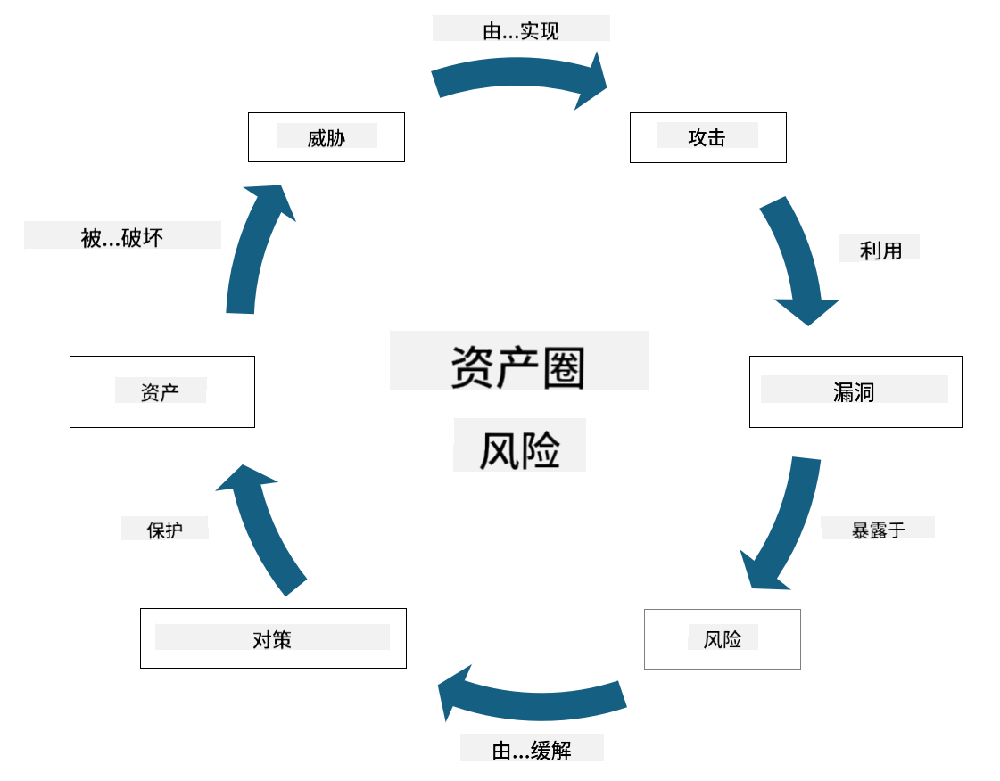

<!--
CO_OP_TRANSLATOR_METADATA:
{
  "original_hash": "fcca304f072cabf206388199e8e2e578",
  "translation_date": "2025-09-03T17:45:41+00:00",
  "source_file": "1.3 Understanding risk management.md",
  "language_code": "zh"
}
-->
# 理解风险管理

## 介绍

在本课程中，我们将讨论：

- 常用安全术语的定义

- 安全控制的类型

- 评估安全风险

## 常用安全术语的定义

这些术语是网络安全和风险管理领域的基本概念。让我们逐一解析这些术语及其相互关系：

1. **威胁代理**：

威胁代理是指可能利用系统或网络中的漏洞造成损害或破坏的个人、团体、组织或自动化系统。威胁代理可以是黑客、恶意软件作者、不满的员工或任何对信息和技术系统构成风险的实体。

2. **威胁**：

威胁是指可能利用系统漏洞并对资产造成损害的潜在事件或行为。威胁包括黑客攻击、数据泄露、拒绝服务攻击等行为。威胁是对组织资产可能造成的潜在伤害的“内容”。

3. **漏洞**：

漏洞是系统设计、实施或配置中的弱点或缺陷，可能被威胁代理利用，从而破坏系统的安全性。漏洞可能存在于软件、硬件、流程或人为行为中。识别和解决漏洞对于减少成功攻击的风险至关重要。

4. **风险**：

风险是威胁与漏洞之间相互作用可能导致的损失、伤害或损害的潜力。它是威胁代理利用漏洞造成负面影响的可能性。风险通常根据其潜在影响和发生的可能性进行评估。

5. **资产**：

资产是组织希望保护的任何有价值的东西。资产可以包括实物（如计算机和服务器）、数据（客户信息、财务记录）、知识产权（商业秘密、专利）以及人力资源（员工的技能和知识）。保护资产是网络安全的核心目标。

6. **暴露**：

暴露是指处于可能受到威胁的状态。当系统或网络中存在漏洞时，就会出现暴露。暴露突出了由于漏洞存在而带来的风险。

7. **控制措施**：

控制措施是为减少与漏洞和威胁相关的风险而采取的措施。控制措施可以是技术性的、程序性的或管理性的，旨在预防、检测或减轻潜在威胁和漏洞的影响。例如防火墙、访问控制、加密、安全政策和员工培训。

总结这些术语之间的关系：威胁代理利用漏洞实施威胁，可能导致风险，对有价值的资产造成损害。暴露发生在漏洞存在时，而控制措施则用于减少风险，通过预防或减轻威胁对资产的影响。这一框架构成了网络安全风险管理的基础，指导组织识别、评估和应对信息系统和资产的潜在风险。

## 安全控制的类型

安全控制是为保护信息系统和资产免受各种威胁和漏洞而实施的措施或保障。根据其重点和目的，安全控制可以分为多个类别。以下是一些常见的安全控制类型：

1. **管理控制**：

这些控制与政策、程序和指导方针相关，旨在规范组织的安全实践和用户行为。

- 安全政策和程序：定义如何在组织内维护安全性的文件化指导。

- 安全意识和培训：教育员工了解安全最佳实践和潜在威胁的项目。

- 事件响应和管理：应对和减轻安全事件的计划。

2. **技术控制**：

技术控制涉及使用技术来实施安全措施并保护系统和数据。技术控制的例子包括：

- 访问控制：根据用户的角色和权限限制资源访问的措施。

- 加密：将数据转换为安全格式以防止未经授权的访问。

- 防火墙：过滤和控制网络流量的安全设备。

- 入侵检测和防御系统（IDPS）：监控网络流量以发现可疑活动的工具。

- 防病毒和反恶意软件：检测和移除恶意软件的程序。

- 身份验证机制：验证用户身份的方法，如密码、生物识别和多因素认证。

- 补丁管理：定期更新软件以解决已知漏洞。

3. **物理控制**：

物理控制是保护物理资产和设施的措施。

- 安保人员和访问控制人员：监控和控制物理场所访问的人员。

- 监控摄像头：用于监控和记录活动的视频监控系统。

- 锁具和物理屏障：限制敏感区域访问的物理措施。

- 环境控制：调节温度、湿度等影响设备和数据中心的环境因素。

4. **操作控制**：

这些控制与确保系统日常安全的操作和活动相关。

- 变更管理：跟踪和批准系统和配置变更的流程。

- 备份和灾难恢复：在系统故障或灾难情况下的数据备份和恢复计划。

- 日志记录和审计：监控和记录系统活动以确保安全和合规。

- 安全编码实践：编写软件以尽量减少漏洞的指导方针。

5. **法律和监管控制**：

这些控制确保遵守相关法律、法规和行业标准。组织需要遵守的标准取决于管辖范围、行业领域等因素。

- 数据保护法规：遵守如GDPR、HIPAA和CCPA等法律。

- 行业特定标准：遵守如PCI DSS等支付卡数据安全标准。

这些安全控制类别共同作用，为组织创建全面的安全态势，帮助保护其系统、数据和资产免受各种威胁。

## 评估安全风险

一些安全专业人士认为风险管理是风险专业人士的职责，但理解管理安全风险的过程对任何安全专业人士来说都很重要，以便用组织其他部门能够理解和采取行动的语言表达安全风险。

组织必须不断评估安全风险，并决定对业务风险采取何种行动（或不采取行动）。以下是通常的评估流程概述。请注意，这一过程通常由组织内的多个团队共同完成，很少有一个团队负责风险管理的整个过程。

1. **识别资产和威胁**：

组织识别其希望保护的资产。这些资产可以包括数据、系统、硬件、软件、知识产权等。接下来，他们识别可能针对这些资产的潜在威胁。

2. **评估漏洞**：

组织随后识别系统或流程中可能被威胁利用的漏洞或弱点。这些漏洞可能源于软件缺陷、配置错误、缺乏安全控制或人为错误。

3. **可能性评估**：

组织接着评估每种威胁发生的可能性。这涉及考虑历史数据、威胁情报、行业趋势和内部因素。可能性可以根据威胁发生的概率分为低、中、高。

4. **影响评估**：

接下来，组织确定每种威胁在利用漏洞后可能造成的影响。影响可能包括财务损失、运营中断、声誉损害、法律后果等。影响也可以根据潜在后果分为低、中、高。

5. **风险计算**：

将可能性和影响评估结合起来，计算每种识别威胁的总体风险级别。这通常通过风险矩阵完成，为可能性和影响级别分配数值或定性描述。结果的风险级别有助于优先处理需要立即关注的风险。

6. **优先级和决策**：

组织随后根据可能性和影响值的综合评估优先处理风险。这使他们能够更有效地分配资源和实施控制措施。高风险威胁需要立即关注，而低风险威胁可能在较长时间内解决。

7. **风险处理**：

根据风险评估，组织决定如何减轻或管理每种风险。这可能包括实施安全控制、通过保险转移风险，甚至接受某些可控的剩余风险（如果修复成本过高等）。

8. **持续监控和审查**：

风险评估不是一次性过程。它应定期进行，或在组织环境发生重大变化时进行。持续监控确保新的威胁、漏洞或业务环境变化得到及时考虑。

通过以这种结构化方式评估安全风险，组织可以就资源分配、安全控制和整体风险管理策略做出明智决策。目标是减少组织的总体风险暴露，同时将安全工作与组织的业务目标和愿景保持一致。

---

**免责声明**：  
本文档使用AI翻译服务[Co-op Translator](https://github.com/Azure/co-op-translator)进行翻译。尽管我们努力确保准确性，但请注意，自动翻译可能包含错误或不准确之处。应以原始语言的文档作为权威来源。对于关键信息，建议使用专业人工翻译。对于因使用本翻译而引起的任何误解或误读，我们概不负责。