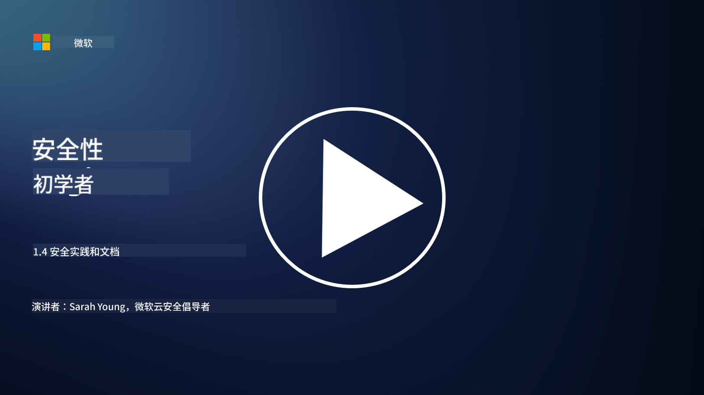

<!--
CO_OP_TRANSLATOR_METADATA:
{
  "original_hash": "d33500902124e52870935bdce4546fcc",
  "translation_date": "2025-09-03T17:26:10+00:00",
  "source_file": "1.4 Security practices and documentation.md",
  "language_code": "zh"
}
-->
# 安全实践与文档

你可能听过“安全政策”、“安全标准”等术语，但实际上许多网络安全专业人士并未正确使用这些术语。因此，在本节中，我们将解释这些术语的含义以及为什么组织会使用它们。

## 介绍

在本课程中，我们将讨论：

- 什么是安全政策？

- 什么是安全标准？

- 什么是安全基线？

- 什么是安全指南？

- 什么是安全程序？

- 在网络安全背景下，法律和法规是什么？

这些术语通常用于网络安全领域，以定义组织内部不同层次的安全文档和实践。让我们来明确每个术语的含义：

## 什么是安全政策？

安全政策是一份高层次的文档，概述了组织的总体安全目标、原则和指导方针。它为安全相关决策提供框架，并设定组织的安全基调。安全政策通常涵盖资源的可接受使用、数据保护、访问控制、事件响应等主题。政策通常与具体解决方案和技术无关。一个许多人熟悉的安全政策示例是组织的可接受使用政策。

## 什么是安全标准？

安全标准是一份更详细、更具体的文档，为在组织内部实施安全控制和措施提供指导和要求。标准比政策更具体和技术化，提供明确的指示和建议，用于配置和维护系统、网络以及流程，以实现安全目标。一个安全标准的示例是：“所有内部数据必须在静态和传输过程中加密。”

## 什么是安全基线？

安全基线是一组最低安全配置，被认为在特定系统、应用程序或环境中是必需的。它定义了一个安全的起点，应该在所有相关实例中实施。安全基线有助于确保组织的IT基础设施中安全的一致性和基本水平。一个安全基线的示例是：“Azure虚拟机不得直接访问互联网。”

## 什么是安全指南？

安全指南是一份文档，当特定安全标准不适用时，提供建议和指导。指南试图解决标准未覆盖或仅部分覆盖的问题中的“灰色地带”。

## 什么是安全程序？

安全程序是一份详细的分步指南，概述了执行与安全相关的流程或任务所需的具体操作和任务。程序是实用且可操作的文档，提供了在事件响应、系统维护、用户入职以及其他安全相关活动中需要遵循的明确步骤。一个安全程序的示例是：“当Microsoft Sentinel生成P1安全事件时，安全运营中心（SOC）必须立即通知值班安全经理，并将事件详情发送给他们。”

总而言之，这些术语代表了组织网络安全框架中的不同层次的文档和指导。安全政策设定高层次目标，标准提供详细要求，基线建立最低安全配置，指南提供最佳实践，程序提供可操作的安全流程步骤。

## 在网络安全背景下，法律和法规是什么？

法律和法规是指由政府和监管机构制定的法律框架，用于定义和执行保护数字系统、数据和信息的规则、标准和要求。这些法律和法规因司法管辖区而异，关注网络安全的不同方面，包括数据保护、隐私、事件报告以及关键基础设施的安全。以下是一些与网络安全相关的法律和法规示例：例如《通用数据保护条例》（GDPR）、《健康保险携带与责任法案》（HIPAA）、《加州消费者隐私法案》（CCPA）、《支付卡行业数据安全标准》（PCI DSS）。

## 延伸阅读

[信息安全政策模板 | SANS研究所](https://www.sans.org/information-security-policy/)

[遵守网络安全和隐私法律法规 | NIST](https://www.nist.gov/mep/cybersecurity-resources-manufacturers/compliance-cybersecurity-and-privacy-laws-and-regulations)

---

**免责声明**：  
本文档使用AI翻译服务[Co-op Translator](https://github.com/Azure/co-op-translator)进行翻译。尽管我们努力确保翻译的准确性，但请注意，自动翻译可能包含错误或不准确之处。原始语言的文档应被视为权威来源。对于关键信息，建议使用专业人工翻译。我们不对因使用此翻译而产生的任何误解或误读承担责任。