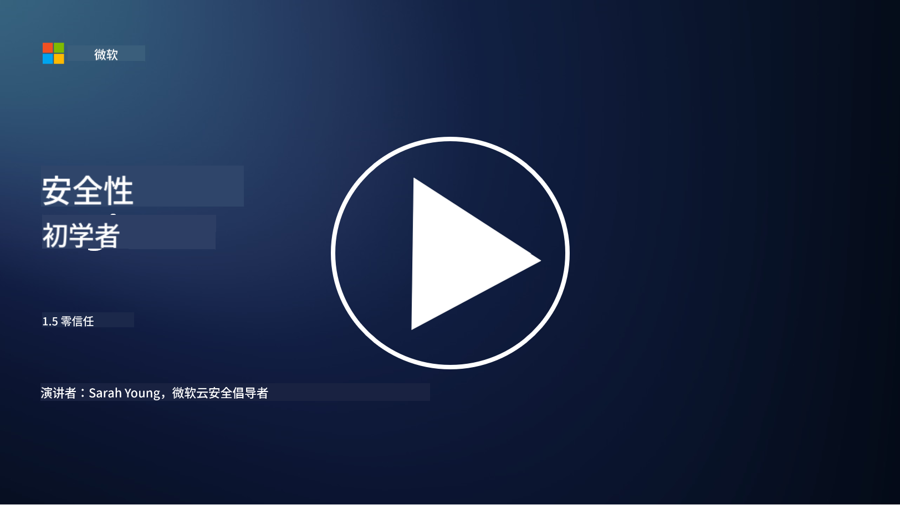
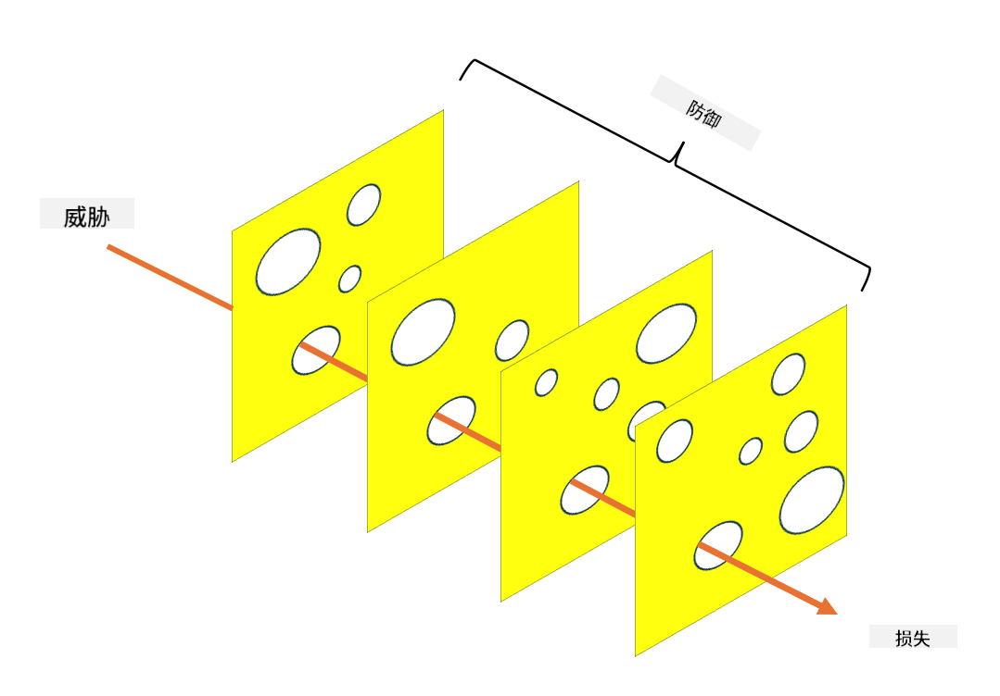

<!--
CO_OP_TRANSLATOR_METADATA:
{
  "original_hash": "75f77f972d2233c584f87c1eb96c983b",
  "translation_date": "2025-09-03T17:17:24+00:00",
  "source_file": "1.5 Zero trust.md",
  "language_code": "zh"
}
-->
# 零信任

“零信任”是近年来在安全领域中经常提到的一个词汇。但它究竟是什么意思？它只是一个流行词吗？在本课中，我们将深入探讨零信任的真正含义。

## 介绍

 - 在本课中，我们将讨论：
   
   - 什么是零信任？
   
   - 零信任与传统安全架构有何不同？
   
   - 什么是纵深防御？

## 零信任

零信任是一种网络安全方法，它挑战了传统的“信任但验证”理念，假设无论是组织网络内部还是外部的任何实体，都不应被默认信任。相反，零信任主张对每个试图访问资源的用户、设备和应用程序进行验证，无论它们位于何处。零信任的核心原则是尽量减少“攻击面”，并降低安全漏洞的潜在影响。

在零信任模型中，以下原则尤为重要：

1. **验证身份**：对所有用户和设备严格执行身份验证和授权，无论它们的地理位置。需要注意的是，身份不一定是人类身份；它也可以是设备、应用程序等。

2. **最小权限**：为用户和设备分配完成任务所需的最低访问权限，从而减少在被攻破时可能造成的损害。

3. **微分段**：将网络资源划分为更小的分段，以限制在发生漏洞时的横向移动。

4. **持续监控**：对用户和设备行为进行持续监控和分析，以检测异常和潜在威胁。现代监控技术还利用机器学习、人工智能和威胁情报来提供更多细节和上下文信息。

5. **数据加密**：对数据在传输和存储过程中进行加密，以防止未经授权的访问。

6. **严格的访问控制**：根据上下文（如用户角色、设备健康状况和网络位置）强制执行访问控制。

微软将零信任分为五个支柱，我们将在后续课程中讨论这些内容。

## 与传统安全架构的区别

零信任与传统安全架构（如基于边界的模型）在多个方面存在差异：

1. **边界 vs. 身份为中心**：传统模型专注于保护网络边界，并假设内部用户和设备在进入后是可信的。而零信任假设威胁可能来自网络内部和外部，并强制执行严格的基于身份的控制。

2. **隐式信任 vs. 显式信任**：传统模型隐式信任网络内的设备和用户，直到证明不可信为止。零信任则显式验证身份并持续监控异常。

3. **扁平网络 vs. 分段网络**：传统架构通常涉及扁平网络，内部用户拥有广泛的访问权限。零信任提倡将网络分割成更小的、隔离的区域，以遏制潜在的漏洞。

4. **被动防御 vs. 主动防御**：传统安全通常依赖于被动措施，如边界防火墙和入侵检测。零信任采取主动方法，假设漏洞是可能的，并尽量减少其影响。

## 纵深防御

纵深防御，也称为分层安全，是一种网络安全策略，涉及部署多层安全控制和措施来保护组织的资产。其目标是创建重叠的防御层，以便即使一层被攻破，其他层仍能提供保护。每一层都专注于安全的不同方面，从而提升组织的整体安全态势。

纵深防御结合了技术、程序和物理安全措施。这些措施可能包括防火墙、入侵检测系统、访问控制、加密、用户培训、安全政策等。其理念是创建多个屏障，使攻击者难以渗透组织的系统和网络。这种方法有时也被称为“瑞士奶酪”模型，这一模型在其他行业（如交通运输）中的事故预防中也有应用。

## 延伸阅读

[什么是零信任？](https://learn.microsoft.com/security/zero-trust/zero-trust-overview?WT.mc_id=academic-96948-sayoung)

[演进中的零信任——微软立场白皮书](https://query.prod.cms.rt.microsoft.com/cms/api/am/binary/RWJJdT?WT.mc_id=academic-96948-sayoung)

[零信任与 BeyondCorp Google Cloud | Google Cloud 博客](https://cloud.google.com/blog/topics/developers-practitioners/zero-trust-and-beyondcorp-google-cloud)

---

**免责声明**：  
本文档使用AI翻译服务[Co-op Translator](https://github.com/Azure/co-op-translator)进行翻译。尽管我们努力确保准确性，但请注意，自动翻译可能包含错误或不准确之处。应以原始语言的文档作为权威来源。对于关键信息，建议使用专业人工翻译。对于因使用本翻译而引起的任何误解或误读，我们概不负责。