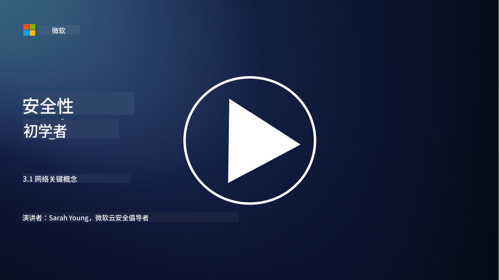
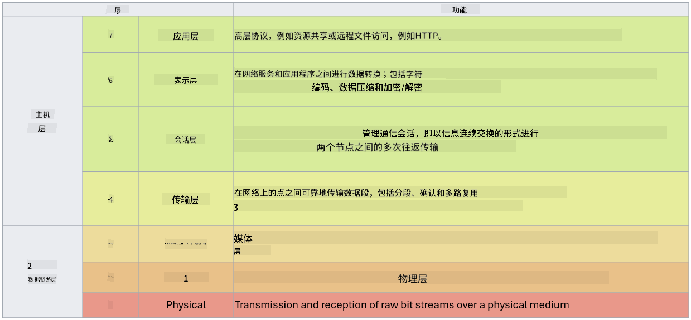

<!--
CO_OP_TRANSLATOR_METADATA:
{
  "original_hash": "252724eceeb183fb9018f88c5e1a3f0c",
  "translation_date": "2025-09-03T17:49:17+00:00",
  "source_file": "3.1 Networking key concepts.md",
  "language_code": "zh"
}
-->
# 网络基础概念

如果你从事过任何与IT相关的工作，很可能接触过网络相关的概念。尽管在现代环境中我们主要通过身份验证来作为边界控制，但这并不意味着网络控制已经过时。虽然这是一个庞大的主题，但在本课中，我们将介绍一些关键的网络概念。

在本课中，我们将讨论：

- 什么是IP地址？
  
- 什么是OSI模型？

- 什么是TCP/UDP？

- 什么是端口号？

- 什么是静态加密和传输加密？

## 什么是IP地址？

IP地址，即互联网协议地址，是分配给每个连接到使用互联网协议进行通信的计算机网络的设备的数字标签。它作为网络中设备的唯一标识符，使它们能够在互联网或其他互联网络中发送和接收数据。IP地址主要有两个版本：IPv4（互联网协议版本4）和IPv6（互联网协议版本6）。IP地址通常以IPv4格式（例如：192.168.1.1）或IPv6格式（例如：2001:0db8:85a3:0000:0000:8a2e:0370:7334）表示。

## 什么是OSI模型？

OSI（开放系统互联）模型是一个概念框架，它将通信系统的功能标准化为七个独立的层。每一层执行特定的任务，并与相邻层进行通信，以确保网络中设备之间的数据通信高效且可靠。这七层从下到上依次为：

1. 物理层

2. 数据链路层

3. 网络层

4. 传输层

5. 会话层

6. 表示层

7. 应用层

OSI模型为理解网络协议和技术如何交互提供了一个通用的参考，无论具体的硬件或软件实现如何。

_参考: https://en.wikipedia.org/wiki/OSI_model_

## 什么是TCP/UDP？

TCP（传输控制协议）和UDP（用户数据报协议）是计算机网络中用于设备间通信的两个基本传输层协议。它们负责将数据分解为数据包进行传输，并在接收端将这些数据包重新组装为原始数据。然而，它们在特性和使用场景上有所不同。

**TCP（传输控制协议）**：

TCP是一种面向连接的协议，提供可靠且有序的数据传输。在数据交换开始之前，它会在发送方和接收方之间建立连接。TCP确保数据包按正确顺序到达，并能够重新传输丢失的数据包，以保证数据的完整性和准确性。这使得TCP适用于需要可靠数据传输的应用，例如网页浏览、电子邮件、文件传输（FTP）和数据库通信。

**UDP（用户数据报协议）**：

UDP是一种无连接协议，提供更快的数据传输，但不具备TCP的可靠性。它在发送数据之前不会建立正式连接，也没有确认或重新传输丢失数据包的机制。UDP适用于速度和效率比可靠性更重要的应用，例如实时通信、流媒体、在线游戏和DNS查询。

总之，TCP优先考虑可靠性和有序传输，适合需要数据准确性的应用，而UDP注重速度和效率，适合在允许少量数据丢失或顺序混乱的情况下追求低延迟的应用。选择使用TCP还是UDP取决于具体应用或服务的需求。

## 什么是端口号？

在网络中，端口号是一个用于区分单个设备上运行的不同服务或应用的数字标识符。端口号帮助将接收到的数据路由到相应的应用程序。端口号是16位无符号整数，范围从0到65535，分为三个类别：

- 知名端口（0-1023）：保留给标准服务，例如HTTP（端口80）和FTP（端口21）。

- 注册端口（1024-49151）：用于不属于知名范围但已正式注册的应用和服务。

- 动态/私有端口（49152-65535）：供应用程序临时或私有使用。

## 什么是静态加密和传输加密？

加密是将数据转换为安全格式以防止未经授权访问或篡改的过程。加密可以应用于“静态数据”（存储在设备或服务器上的数据）和“传输中的数据”（在设备之间或通过网络传输的数据）。

静态加密：这是指对存储在设备、服务器或存储系统上的数据进行加密。即使攻击者获得了存储介质的物理访问权限，没有加密密钥也无法访问数据。这对于在设备被盗、数据泄露或未经授权访问的情况下保护敏感数据至关重要。

传输加密：这是指对在设备之间或通过网络传输的数据进行加密。这可以防止数据在传输过程中被窃听或未经授权拦截。常见的传输加密协议包括用于网页通信的HTTPS和用于保护各种网络流量的TLS/SSL。

## 延伸阅读
- [IP地址如何工作？(howtogeek.com)](https://www.howtogeek.com/341307/how-do-ip-addresses-work/)
- [理解IP地址：入门指南 (geekflare.com)](https://geekflare.com/understanding-ip-address/)
- [什么是OSI模型？OSI的7层解释 (techtarget.com)](https://www.techtarget.com/searchnetworking/definition/OSI)
- [OSI模型——用简单语言解释的7层网络模型 (freecodecamp.org)](https://www.freecodecamp.org/news/osi-model-networking-layers-explained-in-plain-english/)
- [TCP/IP协议 - IBM文档](https://www.ibm.com/docs/en/aix/7.3?topic=protocol-tcpip-protocols)
- [常见端口速查表：终极端口和协议列表 (stationx.net)](https://www.stationx.net/common-ports-cheat-sheet/)
- [Azure静态数据加密 - Azure安全 | Microsoft Learn](https://learn.microsoft.com/azure/security/fundamentals/encryption-atrest?WT.mc_id=academic-96948-sayoung)

---

**免责声明**：  
本文档使用AI翻译服务[Co-op Translator](https://github.com/Azure/co-op-translator)进行翻译。尽管我们努力确保翻译的准确性，但请注意，自动翻译可能包含错误或不准确之处。原始语言的文档应被视为权威来源。对于关键信息，建议使用专业人工翻译。我们不对因使用此翻译而产生的任何误解或误读承担责任。