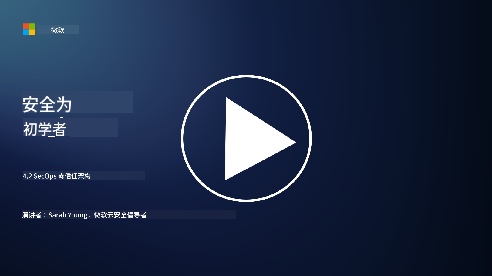

<!--
CO_OP_TRANSLATOR_METADATA:
{
  "original_hash": "45bbdc114e70936816b0b3e7c40189cf",
  "translation_date": "2025-09-03T17:33:03+00:00",
  "source_file": "4.2 SecOps zero trust architecture.md",
  "language_code": "zh"
}
-->
# SecOps 零信任架构

安全运营是零信任架构的两个组成部分，在本课程中我们将学习以下内容：

- IT架构如何构建以支持集中式日志收集？

- 现代IT环境中的安全运营最佳实践是什么？

## IT架构如何构建以支持集中式日志收集？

集中式日志收集是现代安全运营的关键组成部分。它使组织能够将来自服务器、应用程序、网络设备和安全工具等各种来源的日志和数据汇聚到一个中央存储库中，用于分析、监控和事件响应。以下是支持集中式日志收集的IT架构构建最佳实践：

1. **日志源集成**：

- 确保所有相关设备和系统都配置为生成日志，包括服务器、防火墙、路由器、交换机、应用程序和安全设备。

- 配置日志源将日志转发到集中式日志收集器或管理系统。

2. **选择合适的SIEM工具**：

- 选择与组织需求和规模相匹配的SIEM（安全信息和事件管理）解决方案。

- 确保所选解决方案支持日志收集、聚合、分析和报告功能。

3. **可扩展性和冗余**：

- 设计架构以支持扩展，能够容纳不断增长的日志源数量和日志量。

- 实施冗余以确保高可用性，防止因硬件或网络故障导致的中断。

4. **安全传输日志**：

- 使用安全协议（如TLS/SSL或IPsec）将日志从源传输到集中式存储库。

- 实施认证和访问控制，确保只有授权设备可以发送日志。

5. **标准化**：

- 标准化日志格式并规范化数据，以确保一致性和便于分析。

6. **存储和保留**：

- 根据合规性和安全要求确定日志的适当保留期限。

- 安全存储日志，防止未经授权的访问和篡改。

## 现代IT环境中的安全运营最佳实践是什么？

除了集中式日志收集，以下是现代IT环境中的安全运营最佳实践：

1. **持续监控**：实施网络和系统活动的持续监控，以实时检测和响应威胁。

2. **威胁情报**：通过利用威胁情报源和服务，及时了解新兴威胁和漏洞。

3. **用户培训**：定期开展安全意识培训，降低与社会工程和网络钓鱼攻击相关的风险。

4. **事件响应计划**：制定并测试事件响应计划，以确保对安全事件的快速有效响应。

5. **安全自动化**：利用安全自动化和编排工具简化事件响应和重复性任务。

6. **备份和恢复**：实施强大的备份和灾难恢复解决方案，以确保在数据丢失或勒索软件攻击情况下的数据可用性。

## 延伸阅读

- [Microsoft Security Best Practices module: Security operations | Microsoft Learn](https://learn.microsoft.com/security/operations/security-operations-videos-and-decks?WT.mc_id=academic-96948-sayoung)
- [Security operations - Cloud Adoption Framework | Microsoft Learn](https://learn.microsoft.com/azure/cloud-adoption-framework/secure/security-operations?WT.mc_id=academic-96948-sayoung)
- [What is Security Operations and Analytics Platform Architecture? A Definition of SOAPA, How It Works, Benefits, and More (digitalguardian.com)](https://www.digitalguardian.com/blog/what-security-operations-and-analytics-platform-architecture-definition-soapa-how-it-works#:~:text=All%20in%20all%2C%20security%20operations%20and%20analytics%20platform,become%20more%20efficient%20and%20operative%20with%20your%20security.)

---

**免责声明**：  
本文档使用AI翻译服务[Co-op Translator](https://github.com/Azure/co-op-translator)进行翻译。尽管我们努力确保翻译的准确性，但请注意，自动翻译可能包含错误或不准确之处。应以原始语言的文档作为权威来源。对于关键信息，建议使用专业人工翻译。我们对因使用此翻译而产生的任何误解或误读不承担责任。