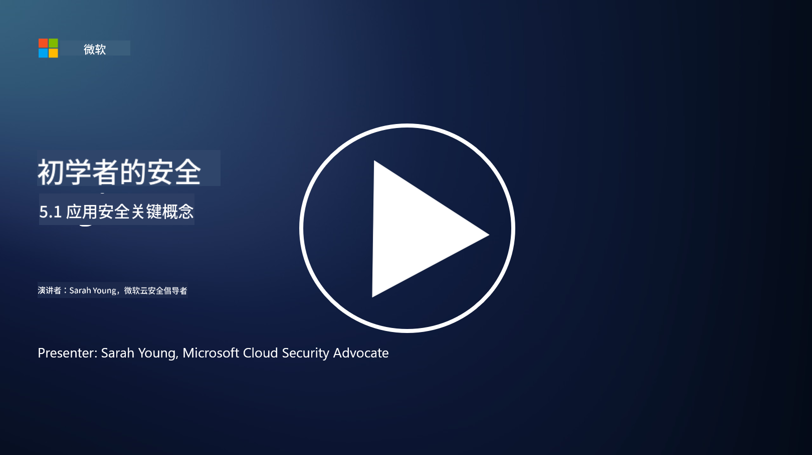

<!--
CO_OP_TRANSLATOR_METADATA:
{
  "original_hash": "e4b56bb23078d3ffb7ad407d280b0c36",
  "translation_date": "2025-09-03T17:29:21+00:00",
  "source_file": "5.1 AppSec key concepts.md",
  "language_code": "zh"
}
-->
# 应用安全关键概念

应用安全是一门独立的安全专业。在本课程的这一部分，我们将深入探讨应用安全。

## 介绍

在本课中，我们将讨论：

- 什么是应用安全？

- 应用安全的关键概念/原则是什么？

## 什么是应用安全？

应用安全，通常缩写为 "AppSec"，是指保护软件应用免受安全威胁、漏洞和攻击的实践。它包括在应用的开发、部署和维护生命周期中，用于识别、缓解和预防安全风险的流程、技术和工具。

应用安全至关重要，因为应用程序是网络攻击的常见目标。恶意行为者利用软件中的漏洞和弱点来获取未经授权的访问、窃取数据、中断服务或执行其他恶意活动。有效的应用安全有助于确保应用及其相关数据的机密性、完整性和可用性。

## 应用安全的关键概念/原则是什么？

应用安全的关键概念和原则包括：

1. **设计即安全**：

- 应从一开始就在应用的设计和架构中集成安全性，而不是事后补充。

2. **输入验证**：

- 所有用户输入都应进行验证，以确保其符合预期格式，并且没有恶意代码或数据。

3. **输出编码**：

- 发送到客户端的数据应进行适当编码，以防止诸如跨站脚本（XSS）等漏洞。

4. **身份验证和授权**：

- 验证用户身份，并根据其角色和权限授权访问资源。

5. **数据保护**：

- 敏感数据在存储、传输和处理时应进行加密，以防止未经授权的访问。

6. **会话管理**：

- 安全的会话管理确保用户会话免受劫持和未经授权的访问。

7. **安全依赖项**：

- 确保所有软件依赖项及时更新安全补丁，以防止漏洞。

8. **错误处理和日志记录**：

- 实施安全的错误处理，避免泄露敏感信息，并确保安全的日志记录实践。

9. **安全测试**：

- 定期使用渗透测试、代码审查和自动扫描工具等方法测试应用的漏洞。

10. **安全软件开发生命周期（SDLC）**：

- 在软件开发生命周期的每个阶段（从需求到部署和维护）中集成安全实践。

## 延伸阅读

- [SheHacksPurple: 什么是应用安全？ - YouTube](https://www.youtube.com/watch?v=eNmccQNzSSY)
- [什么是应用安全？ - Cisco](https://www.cisco.com/c/en/us/solutions/security/application-first-security/what-is-application-security.html#~how-does-it-work)
- [什么是应用安全？保护软件的流程和工具 | CSO Online](https://www.csoonline.com/article/566471/what-is-application-security-a-process-and-tools-for-securing-software.html)
- [OWASP Cheat Sheet Series | OWASP Foundation](https://owasp.org/www-project-cheat-sheets/)

---

**免责声明**：  
本文档使用AI翻译服务[Co-op Translator](https://github.com/Azure/co-op-translator)进行翻译。尽管我们努力确保翻译的准确性，但请注意，自动翻译可能包含错误或不准确之处。原始语言的文档应被视为权威来源。对于关键信息，建议使用专业人工翻译。我们不对因使用此翻译而产生的任何误解或误读承担责任。