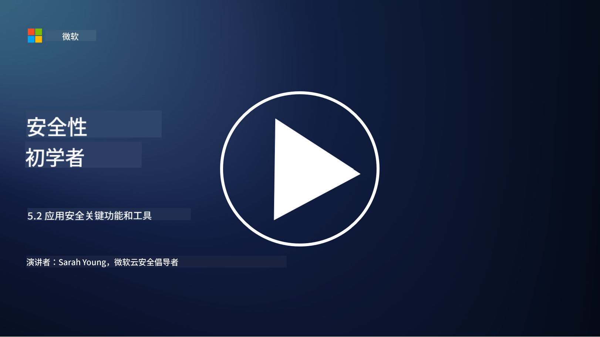

<!--
CO_OP_TRANSLATOR_METADATA:
{
  "original_hash": "790a3fa7e535ec60bb51bde13e759781",
  "translation_date": "2025-09-03T17:34:44+00:00",
  "source_file": "5.2 AppSec key capabilities.md",
  "language_code": "zh"
}
-->
## 介绍

在本节中，我们将讨论应用程序安全中使用的核心工具和功能的更多细节。

## 应用程序安全的关键功能和工具

应用程序安全中使用的关键功能和工具对于识别、缓解和防止软件应用中的安全漏洞和威胁至关重要。以下是一些最重要的工具和功能：

**1. 静态应用程序安全测试 (SAST)**：

- **功能**：分析源代码、字节码或二进制代码，以识别应用程序代码库中的安全漏洞。

- **工具**：例如 Fortify、Checkmarx 和 Veracode。

**2. 动态应用程序安全测试 (DAST)**：

- **功能**：扫描运行中的应用程序，通过发送输入请求并分析响应来识别漏洞。

- **工具**：例如 ZAP、Burp Suite 和 Qualys Web Application Scanning。

**3. 交互式应用程序安全测试 (IAST)**：

- **功能**：结合 SAST 和 DAST 的元素，在运行时分析代码，提供更准确的结果并减少误报。

- **工具**：例如 Contrast Security 和 HCL AppScan。

**4. 运行时应用程序自我保护 (RASP)**：

- **功能**：实时监控和保护应用程序，检测并响应发生的安全威胁。

- **工具**：例如 Veracode Runtime Protection 和 F5 Advanced WAF with RASP。

**5. Web 应用防火墙 (WAFs)**：

- **功能**：在应用程序和互联网之间提供保护层，过滤传入流量并阻止恶意请求。

- **工具**：例如 ModSecurity、AWS WAF 和 Akamai Kona Site Defender。

**6. 依赖扫描**：

- **功能**：识别应用程序中使用的第三方库和组件中的漏洞。

- **工具**：例如 OWASP Dependency-Check 和 Snyk。

**7. 渗透测试 (Pen Testing)**：

- **功能**：模拟真实世界的攻击以发现漏洞并评估应用程序的安全性。

- **工具**：由认证的道德黑客和安全专业人员使用各种工具进行，例如 Metasploit 和 Nmap。

**8. 安全扫描和分析**：

- **功能**：扫描已知漏洞、配置错误和安全配置错误。

- **工具**：例如 Nessus、Qualys Vulnerability Management 和 OpenVAS。

**9. 容器安全工具**：

- **功能**：专注于保护容器化应用程序及其环境。

- **工具**：例如 Docker Security Scanning 和 Aqua Security。

**10. 安全开发培训**：

- **功能**：为开发团队提供培训和意识计划，以促进安全编码实践。

- **工具**：定制的培训计划和平台。

**11. 安全测试框架**：

- **功能**：为不同的应用程序安全测试需求提供全面的测试框架。

- **工具**：OWASP Amass、OWASP OWTF 和 FrAppSec。

**12. 安全代码审查工具**：

- **功能**：审查源代码中的安全漏洞和编码最佳实践。

- **工具**：例如 SonarQube 和 Checkmarx。

**13. 安全 API 和微服务工具**：

- **功能**：专注于保护 API 和微服务，包括身份验证、授权和数据保护。

- **工具**：例如 Apigee、AWS API Gateway 和 Istio。

## 延伸阅读

- [什么是应用程序安全？概念、工具和最佳实践 | HackerOne](https://www.hackerone.com/knowledge-center/what-application-security-concepts-tools-best-practices)
- [什么是 IAST？（交互式应用程序安全测试）(comparitech.com)](https://www.comparitech.com/net-admin/what-is-iast/)
- [10 种应用程序安全测试工具：何时以及如何使用它们 (cmu.edu)](https://insights.sei.cmu.edu/blog/10-types-of-application-security-testing-tools-when-and-how-to-use-them/)
- [改变网络安全风险的平衡：安全设计和默认原则与方法 | Cyber.gov.au](https://www.cyber.gov.au/about-us/view-all-content/publications/principles-and-approaches-for-security-by-design-and-default)

---

**免责声明**：  
本文档使用AI翻译服务[Co-op Translator](https://github.com/Azure/co-op-translator)进行翻译。虽然我们努力确保翻译的准确性，但请注意，自动翻译可能包含错误或不准确之处。原始语言的文档应被视为权威来源。对于关键信息，建议使用专业人工翻译。我们不对因使用此翻译而产生的任何误解或误读承担责任。