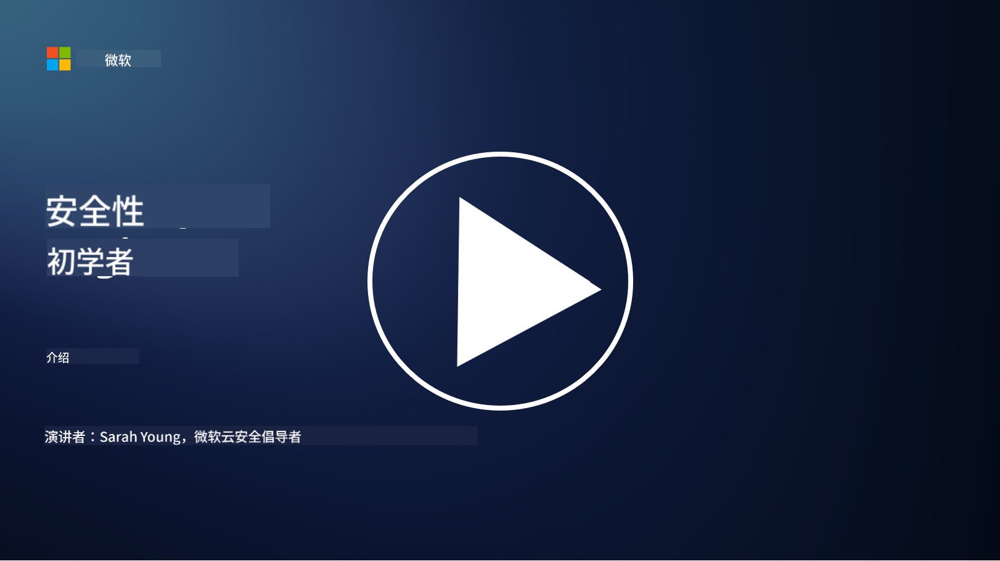

<!--
CO_OP_TRANSLATOR_METADATA:
{
  "original_hash": "0f9381fb23638f9341416474ce3c1563",
  "translation_date": "2025-09-03T17:02:53+00:00",
  "source_file": "README.md",
  "language_code": "zh"
}
-->
  
  
  
  
  
  

# 🚀 初学者网络安全课程 – 学习计划  

在这个快速变化的人工智能技术应用时代，了解如何保护IT系统变得尤为重要。本课程旨在教授您网络安全的基本概念，帮助您开启安全学习之旅。课程内容与具体厂商无关，分为多个小节，每节大约需要30-60分钟完成。每节课都包含一个小测验，并提供进一步阅读的链接，方便您深入了解相关主题。  

  

课程内容 📚  

- 🔐 基本网络安全概念，例如CIA三元组、风险与威胁的区别等。  
- 🛡️ 了解什么是安全控制及其形式。  
- 🌐 了解零信任的概念及其在现代网络安全中的重要性。  
- 🔑 掌握身份、网络、安全运营、基础设施和数据安全的关键概念和主题。  
- 🔧 提供实施安全控制的工具示例。  

课程不涉及 🙅‍♂️  

- 🚫 如何使用具体的安全工具。  
- 🚫 如何进行“黑客”或红队/攻击性安全测试。  
- 🚫 学习具体的合规标准。  

  

完成本课程后，您可以继续学习我们的Microsoft Learn模块。我们推荐您学习 [Microsoft Security, Compliance, and Identity Fundamentals.](https://learn.microsoft.com/training/paths/describe-concepts-of-security-compliance-identity/?WT.mc_id=academic-96948-sayoung)  

最终，您可以考虑参加 [Exam SC-900: Microsoft Security, Compliance, and Identity Fundamentals exam.](https://learn.microsoft.com/credentials/certifications/exams/sc-900/?WT.mc_id=academic-96948-sayoung)  

> 💁 如果您对本课程有任何反馈或建议，或者觉得我们遗漏了某些内容，欢迎告诉我们！  

## 模块概览 📝  
| **模块编号** | **模块名称**                           | **教授的概念**                  | **学习目标**                                                                                          |  
|-------------------|-------------------------------------------|--------------------------------------|-----------------------------------------------------------------------------------------------------------------|  
| **1.1**           | 基本安全概念                             | [CIA三元组](https://github.com/microsoft/Security-101/blob/main/1.1%20The%20CIA%20triad%20and%20other%20key%20concepts.md)                        | 学习保密性、可用性和完整性。此外还包括真实性、不可否认性和隐私。 |  
| **1.2**           | 基本安全概念                             | [常见网络安全威胁](https://github.com/microsoft/Security-101/blob/main/1.2%20Common%20cybersecurity%20threats.md)        | 学习个人和组织面临的常见网络安全威胁。                             |  
| **1.3**           | 基本安全概念                             | [理解风险管理](https://github.com/microsoft/Security-101/blob/main/1.3%20Understanding%20risk%20management.md)       | 学习评估和理解风险——影响/可能性以及实施控制措施。                                                                                                               | |  
| **1.4**           | 基本安全概念                             | [安全实践与文档](https://github.com/microsoft/Security-101/blob/main/1.4%20Security%20practices%20and%20documentation.md) | 学习政策、程序、标准与法规/法律之间的区别。                         |  
| **1.5**           | 基本安全概念                             | [零信任](https://github.com/microsoft/Security-101/blob/main/1.5%20Zero%20trust.md)                           | 学习什么是零信任及其对架构的影响？什么是纵深防御？                   |  
| **1.6**           | 基本安全概念                             | [共享责任模型](https://github.com/microsoft/Security-101/blob/main/1.6%20Shared%20responsibility%20model.md)                           | 什么是共享责任模型及其对网络安全的影响？                  |  
| **1.7**           | [模块结束测验](https://github.com/microsoft/Security-101/blob/main/1.7%20End%20of%20module%20quiz.md)                        |                                      |                                                                                                                 |  
| **2.1**           | 身份与访问管理基础                      | [IAM关键概念](https://github.com/microsoft/Security-101/blob/main/2.1%20IAM%20key%20concepts.md)                     | 学习最小权限原则、职责分离以及IAM如何支持零信任。               |  
| **2.2**           | 身份与访问管理基础                      | [IAM零信任架构](https://github.com/microsoft/Security-101/blob/main/2.2%20IAM%20zero%20trust%20architecture.md)          | 学习身份如何成为现代IT环境的新边界及其缓解的威胁。          |  
| **2.3**           | 身份与访问管理基础                      | [IAM能力](https://github.com/microsoft/Security-101/blob/main/2.3%20IAM%20capabilities.md)                     | 学习IAM能力和控制措施以保护身份。                                                  |  
| **2.4**           | [模块结束测验](https://github.com/microsoft/Security-101/blob/main/2.4%20End%20of%20module%20quiz.md)                        |                                      |                                                                                                                 |  
| **3.1**           | 网络安全基础                            | [网络关键概念](https://github.com/microsoft/Security-101/blob/main/3.1%20Networking%20key%20concepts.md)              | 学习网络概念（IP地址、端口号、加密等）。                                 |  
| **3.2**           | 网络安全基础                            | [网络零信任架构](https://github.com/microsoft/Security-101/blob/main/3.2%20Networking%20zero%20trust%20architecture.md)   | 学习网络如何为端到端零信任架构做出贡献及其缓解的威胁。                  |  
| **3.3**           | 网络安全基础                            | [网络安全能力](https://github.com/microsoft/Security-101/blob/main/3.3%20Network%20security%20capabilities.md)        | 学习网络安全工具——防火墙、WAF、DDoS保护等。                                    |  
| **3.4**           | [模块结束测验](https://github.com/microsoft/Security-101/blob/main/3.4%20End%20of%20module%20quiz.md)                        |                                      |                                                                                                                 |  
| **4.1**           | 安全运营基础                            | [SecOps关键概念](https://github.com/microsoft/Security-101/blob/main/4.1%20SecOps%20key%20concepts.md)                  | 学习为什么安全运营很重要以及它与普通IT运营团队的区别。                  |  
| **4.2**           | 安全运营基础                            | [SecOps零信任架构](https://github.com/microsoft/Security-101/blob/main/4.2%20SecOps%20zero%20trust%20architecture.md)       | 学习安全运营如何为端到端零信任架构做出贡献及其缓解的威胁。                      |  
| **4.3**           | 安全运营基础                            | [SecOps能力](https://github.com/microsoft/Security-101/blob/main/4.3%20SecOps%20capabilities.md)                  | 学习安全运营工具——SIEM、XDR等。                                                                    |  
| **4.4**           | [模块结束测验](https://github.com/microsoft/Security-101/blob/main/4.4%20End%20of%20module%20quiz.md)                        |                                      |                                                                                                                 |  
| **5.1**           | 应用安全基础                            | [AppSec关键概念](https://github.com/microsoft/Security-101/blob/main/5.1%20AppSec%20key%20concepts.md)                  | 学习应用安全概念，例如设计安全、输入验证等。                                    |  
| **5.2**           | 应用安全基础                            | [AppSec能力](https://github.com/microsoft/Security-101/blob/main/5.2%20AppSec%20key%20capabilities.md)                  | 学习应用安全工具：管道安全工具、代码扫描、秘密扫描等。                       |  
| **5.3**           | [模块结束测验](https://github.com/microsoft/Security-101/blob/main/5.3%20End%20of%20module%20quiz.md)                        |                                      |                                                                                                                 |  
| **6.1**           | 基础设施安全基础                        | [基础设施安全关键概念](https://github.com/microsoft/Security-101/blob/main/6.1%20Infrastructure%20security%20key%20concepts.md) | 学习系统加固、补丁管理、安全卫生、容器安全。                                  |  
| **6.2**           | 基础设施安全基础                        | [基础设施安全能力](https://github.com/microsoft/Security-101/blob/main/6.2%20Infrastructure%20security%20capabilities.md) | 学习可协助基础设施安全的工具，例如CSPM、容器安全等。            |  
| **6.3**           | [模块结束测验](https://github.com/microsoft/Security-101/blob/main/6.3%20End%20of%20module%20quiz.md)                        |                                      |                                                                                                                 |  
| **7.1**           | 数据安全基础                            | [数据安全关键概念](https://github.com/microsoft/Security-101/blob/main/7.1%20Data%20security%20key%20concepts.md)           | 学习数据分类和保留及其对组织的重要性。                     |  
| **7.2**           | 数据安全基础                            | [数据安全能力](https://github.com/microsoft/Security-101/blob/main/7.2%20Data%20security%20capabilities.md)           | 学习数据安全工具——DLP、内部风险管理、数据治理等。                          |  
| **7.3**           | [模块结束测验](https://github.com/microsoft/Security-101/blob/main/7.3%20End%20of%20module%20quiz.md)                        |                                      |                                                                                                                 |  
| **8.1**           | AI安全基础                              | [AI安全关键概念](https://github.com/microsoft/Security-101/blob/main/8.1%20AI%20security%20key%20concepts.md)          | 学习传统安全与AI安全的异同。                 |  
| **8.2**           | AI安全基础                              | [AI安全能力](https://github.com/microsoft/Security-101/blob/main/8.2%20AI%20security%20capabilities.md)           | 学习AI安全工具及可用于保护AI的控制措施。                         |  
| **8.3**           | AI安全基础                              | [负责任的AI](https://github.com/microsoft/Security-101/blob/main/8.3%20Responsible%20AI.md)          | 学习什么是负责任的AI以及安全专业人员需要注意的AI特定风险。                          |  
| **8.4**           | [模块结束测验](https://github.com/microsoft/Security-101/blob/main/8.4%20End%20of%20module%20quiz.md)                        |                                      |                                                                                                                 |  

## 🎒 其他课程  

我们的团队还制作了其他课程！查看以下内容：  

- [初学者生成式AI课程](https://aka.ms/genai-beginners)  
- [初学者生成式AI课程 .NET](https://github.com/microsoft/Generative-AI-for-beginners-dotnet)  
- [使用JavaScript的生成式AI课程](https://github.com/microsoft/generative-ai-with-javascript)  
- [使用Java的生成式AI课程](https://github.com/microsoft/Generative-AI-for-beginners-java)  
- [人工智能入门](https://aka.ms/ai-beginners)
- [数据科学入门](https://aka.ms/datascience-beginners)
- [机器学习入门](https://aka.ms/ml-beginners)
- [网络安全入门](https://github.com/microsoft/Security-101) 
- [Web开发入门](https://aka.ms/webdev-beginners)
- [物联网入门](https://aka.ms/iot-beginners)
- [XR开发入门](https://github.com/microsoft/xr-development-for-beginners)
- [掌握GitHub Copilot进行协作编程](https://github.com/microsoft/Mastering-GitHub-Copilot-for-Paired-Programming)
- [掌握GitHub Copilot为C#/.NET开发者服务](https://github.com/microsoft/mastering-github-copilot-for-dotnet-csharp-developers)
- [选择你的Copilot冒险之旅](https://github.com/microsoft/CopilotAdventures)

---

**免责声明**：  
本文档使用AI翻译服务 [Co-op Translator](https://github.com/Azure/co-op-translator) 进行翻译。尽管我们努力确保翻译的准确性，但请注意，自动翻译可能包含错误或不准确之处。原始语言的文档应被视为权威来源。对于关键信息，建议使用专业人工翻译。我们不对因使用此翻译而产生的任何误解或误读承担责任。